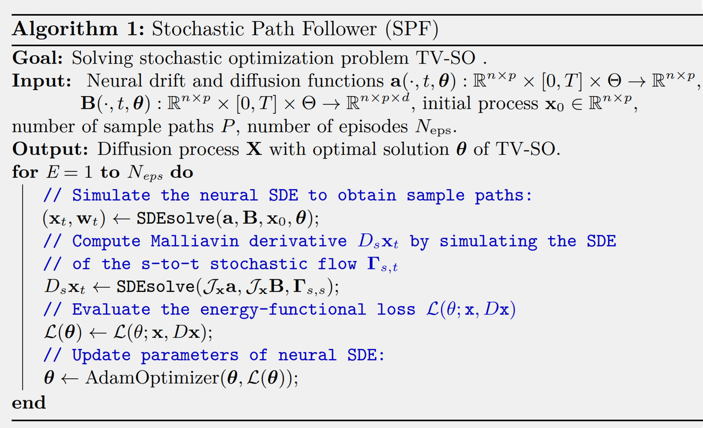
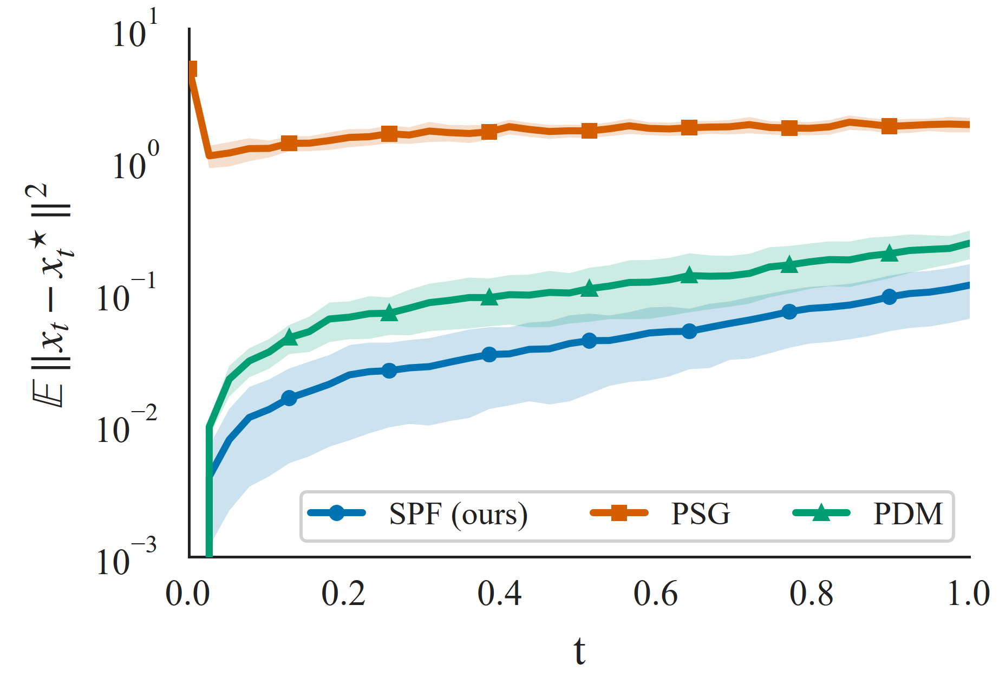
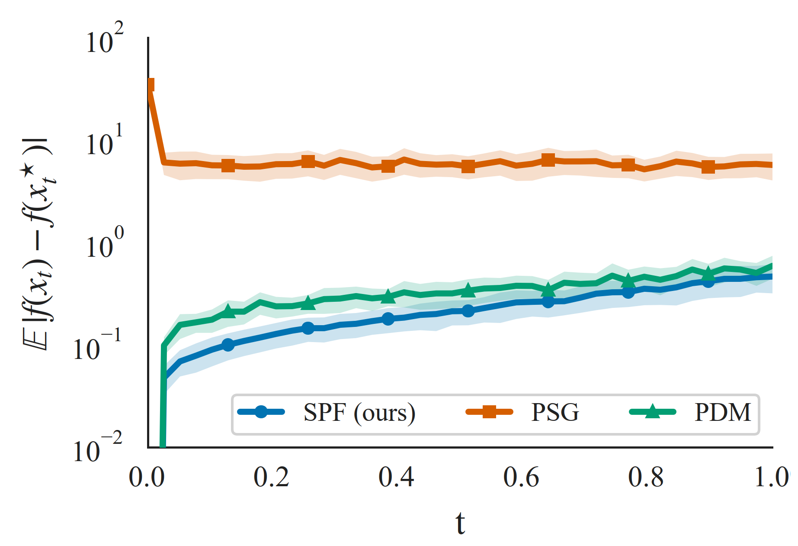
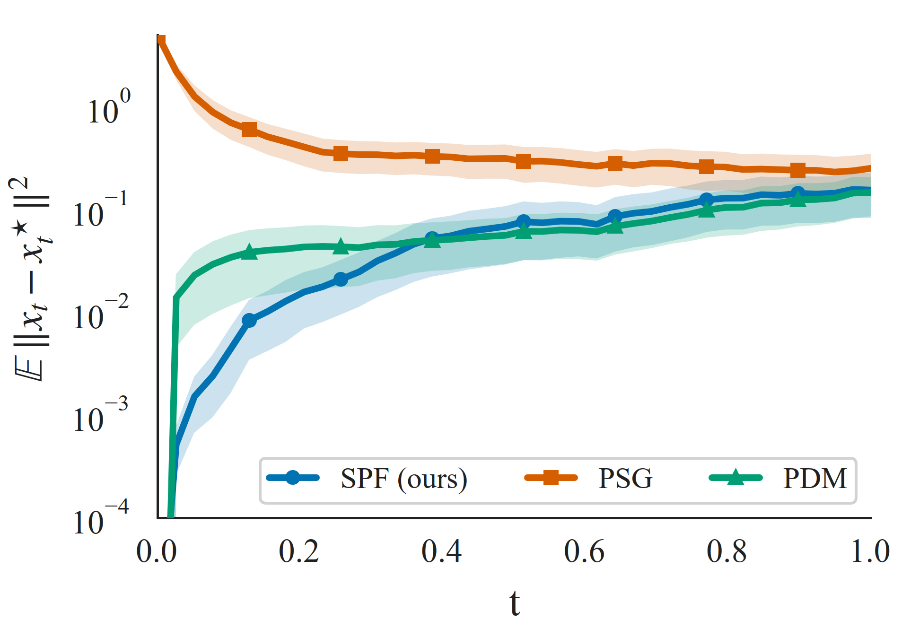
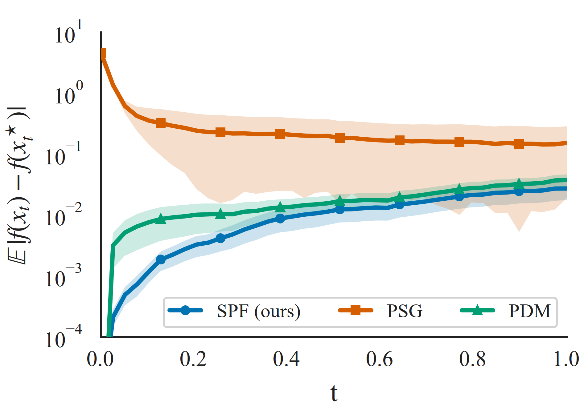
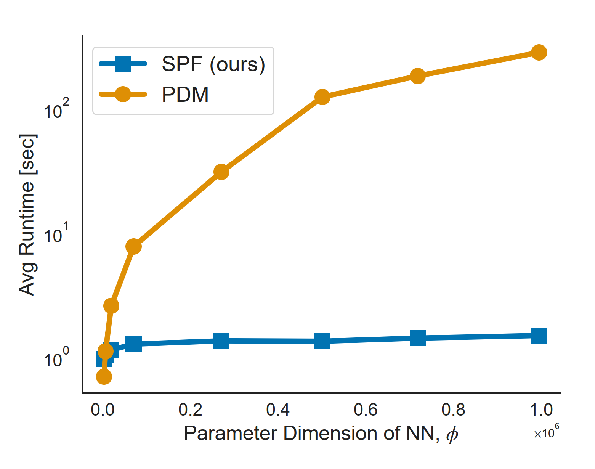

## 📑 Introduction

**SPF** (Stochastic Path Follower ) is a PyTorch implementation for solving (time-varying) stochastic optimization problems when a distribution drift occurs or the respective environmnet is non-stationary.
Specifically, it considers a problem of the form
$\min_{\mathbf{X}} \underset{ (\boldsymbol{\Xi}, \mathbf{x}) \sim \mathbb{P} \otimes \mathbb{Q} }{\mathbb{E}}  \{ f(\mathbf{x}_t, \boldsymbol{\xi}_t, t ) \} $, where the optimization is carried out jointly for every $t \in[0, T]$. 

🎯 **SPF** addresses time-varying stochastic optimization (TV-SO) problems as the stochastic couterpart of conventional time-varying optimization (TV-O) challenges ($\min_{(\mathbf{x}_t)_{t \in [0, T]}} f(\mathbf{x}_t, t), ~t \in [0, T]$).
 It finds non-parametric optimality conditions via Malliavin calculus. Its non-parametric framework provides a learning mechanism insensitive to the parameterization dimension, the challenge which most of the baselines such as adjoint sensitivity models and path-wise differentiation methods (PDMs) struggle with. <br>
🎯 **SPF** provides a scalable neural algorithm for solving stochastic optimization challenges under distribution drift, and as such it is parallel to PDMs and adjoint sensitivity approaches, but far less sensitive to the parameterization dimension. <br>
🎯 **SPF** is competitive with the baseline algorithms from both complexity and performance perspectives.

## ⚙️ Overview of the SPF algotithm:
SPF consists of three main phases as follows.

**(i) Forward pass.** Simulate a neural SDE, with drift and diffusion functions, to obtain the stochastic paths of decision process. In addition, compute the Malliavin derivatives of the decisoin process.

**(ii)  Loss evaluation.** Compute an energy-functional loss associated with the considered TV-SO problem.

**(iii)  Parameter update.** Update the parameters of the neural drift and diffusion functions  using an Adam-type optimizer.

A pseudo-code of the SPF algorithm is provided below.
|  Diagram of SPF algorithm |
| :-------------------------:| 
|    |  
|  |


## 🧪 Usage
This repository provides the python implementaions for two stochastic optimization problems, namely least squares recovey and loggistic regression, both under distribution drift.
It also provides codes of two baselines for the benchmark purposes, namely (i) pathwise-differentiaion method (PDM), as the conventoial neural approach for optimizing neural SDE and the proximal stochastic gradient (PSG) method as a gradient-based baseline.

  ### Experiments:
  
  Please refer to the respective folders to find the implementations of the SPF and the baselines for the least squares recovey and loggistic regression problems.


## 📈  Results
We consider several algorithms from the literature as baselines for comparison. As a learning-based approach, we adopt the pathwise differentiation method (PDM) (Tzen & Raginsky, 2019; Liu et al., 
2019). PDM can be used for joint optimization over the entire time horizon, which is needed for a time-varying optimization problem. 
In addition, we consider the proximal stochastic gradient (PSG) method from (Cutler et al., 2023) as a gradient-based baseline. This algorithm addresses convex optimization problems under distribution drift and is a stochastic gradient descent methods. PSG tracks the optimal decision process by using a stochastic algorithm with iterate averaging.

### (1) Least-Squares Recovery
We consider a least-squares recovery problem with distribution drift utilized in (Cutler et al., 2023; Maity et al., 2023). 
Specifically, this problem aims to recover a variable that follows a non-stationary distribution, based on observations following a Gaussian process with thime-varying mean.  

Figures below compare our SPF algorithm to the learning-based PDM and gradient-based PSG methods, using two performance metrics: (i) the optimality distance, which measures how close the
recovered decision process is to the true target, and (ii) the objective suboptimality, which measures the difference between the objective evaluated at recovered process and the target objective.

|Optimality distance  on the least-squares recovery problem |Objective suboptimality  on the least-squares recovery problem|
|:-------------------------:|:-------------------------:|
|   |  | 
|Although the PDM algorithm achieves an optimality distance close to that of SPF, the SPF method outperforms both PDM and PSG | The same trend holds for objective suboptimality, where SPF exhibits the lowest error among the learning-based and gradient-based approaches |

### (2) Logistic Regression
We now consider an $\ell^2_2$-regularized logistic regression problem leveraged in (Cutler et al., 2023) with a random sequence of soft labels.

Figures below illustrate the performance of the SPF algorithm compared with the learning-based PDM and gradient-based PSG methods in terms of the optimality distance and the objective suboptimality.

|Optimality distance  on the  logistic regression problem |Objective suboptimality  on the  logistic regression problem|
|:-------------------------:|:-------------------------:|
|   |  | 
|The SPF algorithm achieves a superior optimality distance relative to the PDM approach and performs comparably to the PDM method overall | The same pattern is observed for the objective suboptimality, where SPF demonstrates improved performance relative to the gradient-based PSG and comparable performance to the conventional learning-based PDM method|

### (3) Scalability Benchamrk

We evaluate the scalability of the SPF algorithm against the conventional learning-based method (PDM)  in a high-dimensional setup. First, we consider the least-squares recovery problem, vary the dimension of the NN parameterization, and measure the average time required to update the network parameters for one episode.

Figure below presents the average runtime for the SPF and PDM algorithms. The run-time of SPF remains largely unaffected by the NN parameter dimension $\phi$, while PDM exhibits a strong dependence on $\phi$, resulting in significantly higher computational complexity. This difference can be understood by examining the structural distinction between the SPF and PDM algorithms. The SPF algorithm simulates $n + n^2$ SDE. Hence, the dimensionality of the required SDEs is insensitive to the parameterization and does not involve differentiation with respect to it. In contrast, the PDM algorithm must simulate 
both the original SDE and its variational counterpart, which together have a dimension of $n + n  \phi$. Consequently, the dimension of the required SDEs scales directly with the parameterization dimension. These factors make the PDM approach inefficient for high-dimensional NNs.

|Average runtime on the least-squares recovery problem for SPF and PDM|
|:-------------------------:|
|   | 
|The SPF algorithm is mainly insensitive to the parameterization dimension of the considered neural network |


## 🛠️ Dependencies
Tested on:
```
Python 3.11
PyTorch
NumPy
scipy.special
```
Graphs
```
matplotlib
```

## 📚 How to cite our work

Mohsen Amidzadeh, Lauri Viitasaari, Mario Di Francesco, "Non-Parametric Optimization for Scalable Learning in Stochastic Decision Problems", ICML, 2026.🔗 https://openreview.net/forum?id=rD79qEJ5iR
```
@article{
amidzadeh2026NonparametricStochasticOptimization,
title={Non-Parametric Optimization for Scalable Learning in Stochastic Decision Problems},
author={Mohsen Amidzadeh, Lauri Viitasaari, Mario Di Francesco},
journal={International  Conference on Machine Learning (ICML)},
year={2026},
url={https://openreview.net/forum?id=rD79qEJ5iR},
}
```

## 📚 Reference

Cutler, J., Drusvyatskiy, D., and Harchaoui, Z. Stochastic optimization under distributional drift. Journal of Machine
Learning Research, 24(147):1–56, 2023.

Maity, S., Mukherjee, D., Banerjee, M., and Sun, Y. Predictor-corrector algorithms for stochastic optimization under gradual
distribution shift. In International Conference on Learning Representations (ICLR) 2023, 2023.

Tzen, B. and Raginsky, M. Neural stochastic differential equations: Deep latent gaussian models in the diffusion limit.
arXiv preprint arXiv:1905.09883, 2019.
